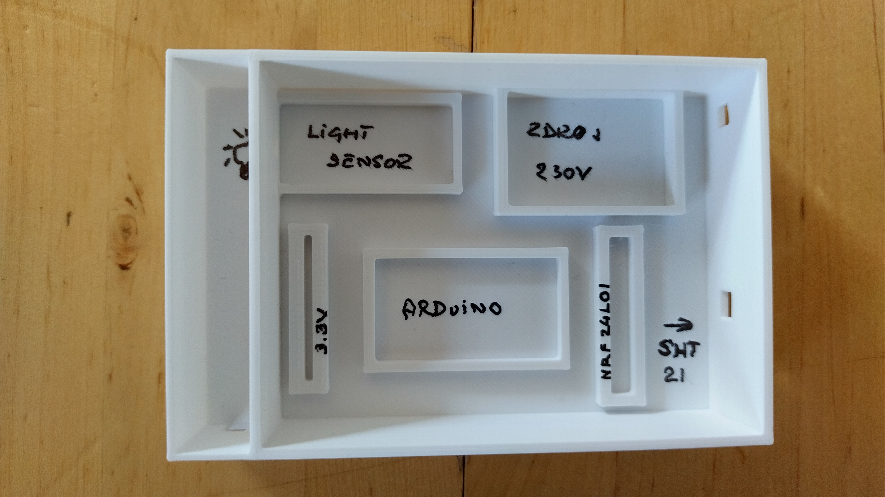
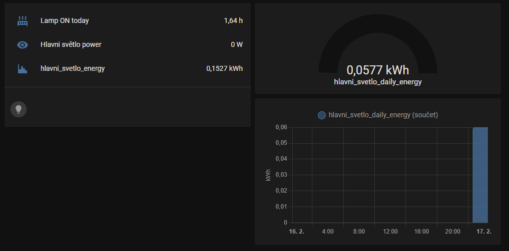

# SHT-21_Light_Sensor_168
- založený na Arduino Pro Mini 168 se senzorem teploty a vlhkosti SHT-21 (GY-21) a světelným senzorem pro kontrolu zapnutí topení (doutnavka). 

Topení má doutnavku, která se rozsvítí vždy když je topení zapnuto a topí. Potřebuji zjistit kdy je topení zapnuto a kolik toho protopí za týden a za měsíc. 
Připojení čidla na doutnavku mi přišlo jak jedno z nejjednodušších řešení. Celý systém je pak postavený na HomeAssistant a integraci Mysensors

# Konfigurace configuration.yaml pro HomeAssistant
je přiložena

Foto rozložení v boxu:
  

obrázek je z tesování, až budou hezčí data obrázek vyněním (topení je světlo při testování)
  
